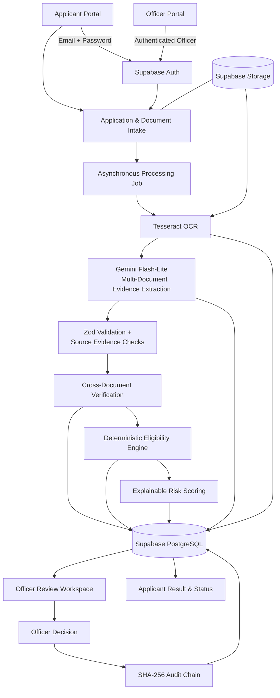

# DOCUSURE PRO

### Intelligent Government Document Verification Platform

> **DOCUSURE PRO** streamlines government scholarship and application verification by combining secure document intake, OCR, GenAI-assisted evidence extraction, deterministic eligibility rules, explainable risk intelligence, officer review, and tamper-evident auditability in one workflow.

[](https://nextjs.org/)
[](https://www.typescriptlang.org/)
[](https://supabase.com/)
[](https://ai.google.dev/)

---

## Overview

Government applications often require officers to inspect multiple documents, compare information across them, verify eligibility rules, and preserve an auditable record of the final decision.

DOCUSURE PRO provides an end-to-end digital workflow for that process:

- applicants authenticate and submit applications securely;
- documents are stored privately and processed through a cloud-based job pipeline;
- OCR extracts document text;
- Gemini assists with structured multi-document evidence extraction;
- deterministic verification compares critical fields across documents;
- deterministic rules evaluate scheme eligibility;
- explainable risk intelligence prioritizes cases for review;
- authorized officers review evidence and make the final decision;
- a SHA-256 chained audit trail preserves the integrity of important processing and decision events.

### Core Principle

> **AI assists with evidence extraction. Deterministic rules evaluate eligibility. Risk intelligence prioritizes review. Authorized officers make the final decision.**

---

## System Architecture



### Logical Flow

```text
Applicant
   │
   ▼
Authentication
   │
   ▼
Application Creation
   │
   ▼
Secure Document Upload
   │
   ▼
Cloud Processing Job
   │
   ├──► OCR / Text & Confidence
   │
   ├──► Gemini Evidence Extraction
   │
   ├──► Cross-Document Verification
   │
   ├──► Eligibility Rules
   │
   └──► Explainable Risk Intelligence
   │
   ▼
Officer Review
   │
   ▼
Officer Decision
   │
   ▼
Tamper-Evident Audit Record
   │
   ▼
Applicant Outcome
```

---

## Applicant & Officer Experience

### Applicant Portal

Applicants can:

- create an account using email and password;
- create a scholarship/application record;
- manually upload required documents;
- track cloud processing progress;
- view application status and final officer outcomes;
- access only applications owned by their authenticated account.

### Officer Portal

Authorized officers can:

- authenticate through a dedicated officer sign-in flow;
- view the live intake queue and recent submissions;
- search and filter applications;
- inspect OCR output and structured evidence;
- review cross-document verification results;
- review deterministic eligibility decisions;
- inspect explainable risk intelligence;
- record the final officer decision;
- inspect tamper-evident audit history.

---

## Verification Pipeline

### 1. Document Intake

The platform supports the core document slots required by the current scholarship workflow:

- Identity Proof
- Income Certificate
- Marksheet
- Domicile Certificate

Uploaded documents are stored in private Supabase Storage and associated with the authenticated application owner.

### 2. OCR

Server-side Tesseract OCR converts document content into machine-readable text while preserving OCR confidence information for downstream processing.

### 3. GenAI Evidence Extraction

Gemini Flash-Lite is used for structured multi-document evidence extraction.

For the current workflow:

> **One application → one combined Gemini analysis request**

The response is validated against typed schemas and source-text evidence checks before persistence.

### 4. Cross-Document Verification

Verification is deterministic and compares critical normalized fields across submitted documents, including:

- applicant name similarity;
- exact date-of-birth consistency;
- document-to-document field agreement.

This layer is intentionally independent from the GenAI model.

### 5. Eligibility Engine

Scheme eligibility is evaluated using deterministic rules such as:

- household income threshold;
- academic merit threshold;
- domicile requirement;
- required-document completeness.

The rules produce auditable outcomes such as `ELIGIBLE`, `INELIGIBLE`, or `REVIEW_REQUIRED` depending on available evidence and rule results.

---

## Explainable Risk Intelligence

DOCUSURE PRO currently uses **`ExplainableRiskScoring_v1`**, an auditable deterministic scoring layer built over a 13-dimensional evidence feature snapshot.

Example feature categories include:

- document completeness;
- OCR confidence;
- extraction confidence;
- name similarity;
- DOB consistency;
- mismatch and exception counts;
- eligibility failures;
- distance from income thresholds.

The engine produces:

- a risk score from `0–100`;
- `LOW`, `MEDIUM`, or `HIGH` risk;
- explicit contributing signals;
- a review-priority recommendation.

### Important Design Boundary

> **Risk intelligence prioritizes officer review and does not override deterministic eligibility rules.**

The current feature interface is designed to support future integration with an offline-trained anomaly-detection model, such as Isolation Forest, without changing the rest of the application architecture.

---

## Tamper-Evident Auditability

Important processing and decision events are persisted in a chained audit structure.

Each event contains:

- event type;
- event data;
- timestamp;
- previous event hash;
- current event hash;
- processing/job linkage where applicable.

A canonicalized event payload is hashed using **SHA-256**, and each event points to the hash of its predecessor.

```text
Event 1 ──hash──► Event 2 ──hash──► Event 3 ──hash──► ... ──► Event N
```

This makes unauthorized modification or chain-link alteration detectable during audit verification.

---

## Security Model

DOCUSURE PRO uses a role-based security model:

| Role | Access |
|---|---|
| **APPLICANT** | Own profile, own applications, own documents, own status/results |
| **OFFICER** | Authorized application intake, evidence review, officer decisions |

Security controls include:

- Supabase email/password authentication;
- server-side role resolution;
- applicant ownership checks;
- Supabase Row Level Security (RLS);
- private document storage;
- server-only service-role usage;
- protected officer routes;
- authenticated applicant/officer session separation.

Sensitive API keys and credentials are never intended to be committed to source control.

---

## Technology Stack

### Frontend

- Next.js App Router
- React
- TypeScript
- Tailwind CSS

### Backend / Platform

- Next.js API routes
- Supabase
- PostgreSQL
- Supabase Auth
- Supabase Storage

### AI / Document Intelligence

- Tesseract OCR
- Google Gemini Flash-Lite
- Zod schema validation

### Verification / Decision Support

- deterministic cross-document verification
- deterministic scholarship eligibility rules
- ExplainableRiskScoring_v1
- SHA-256 audit hashing

### Developer Tooling

- Node.js
- npm
- Git / GitHub
- Vercel-compatible Next.js deployment architecture

---

## Project Structure

```text
DOCUSURE-pro/
├── public/                     # Static assets
├── src/
│   ├── app/
│   │   ├── api/                # API endpoints
│   │   ├── applicant/          # Applicant portal
│   │   ├── officer/            # Officer portal
│   │   ├── processing/         # Processing workspace
│   │   └── ...
│   ├── components/             # Shared UI components
│   ├── lib/                    # Supabase, AI, audit, validation utilities
│   ├── repositories/           # Persistence/data-access layer
│   ├── services/
│   │   ├── ai/                 # Gemini extraction services
│   │   ├── audit/              # Audit chain services
│   │   ├── jobs/               # Processing worker logic
│   │   ├── ocr/                # OCR services
│   │   ├── risk/               # Risk feature extraction/scoring
│   │   ├── rules/               # Eligibility logic
│   │   └── verification/       # Cross-document verification
│   └── types/                  # Shared TypeScript types
├── supabase/
│   ├── migrations/             # Database migrations
│   └── seed.sql                # Development/demo seed data
├── .env.example
├── .gitignore
├── next.config.ts
├── package.json
└── README.md
```

---

## Getting Started

### Prerequisites

- Node.js 20+ (Node.js 22+ is recommended for current Supabase client support)
- npm
- a Supabase project
- a Google AI / Gemini API key

### Installation

```bash
npm install
```

### Environment Configuration

Copy the example environment file:

```bash
cp .env.example .env.local
```

Populate the required values locally:

```env
NEXT_PUBLIC_SUPABASE_URL=
NEXT_PUBLIC_SUPABASE_ANON_KEY=
SUPABASE_SERVICE_ROLE_KEY=
GEMINI_API_KEY=
GEMINI_MODEL=gemini-3.5-flash-lite
DATABASE_URL=
POSTGRES_URL=
```

> **Never commit real secrets.** Keep `.env.local` local and use deployment-platform environment variables for hosted environments.

### Run Locally

```bash
npm run dev
```

Open:

```text
http://localhost:3000
```

---

## Database

Supabase PostgreSQL stores:

- applications;
- document metadata;
- extracted fields;
- verification results;
- eligibility rule results and exceptions;
- processing jobs;
- risk results;
- officer reviews/decisions;
- audit events;
- authenticated user profiles.

Database changes are maintained under:

```text
supabase/migrations/
```

---

## Deployment Architecture

The project is designed for a hosted architecture using:

```text
GitHub
  │
  ▼
Vercel (Next.js)
  │
  ├── Applicant UI
  ├── Officer UI
  └── Server/API routes
       │
       ├── Supabase Auth
       ├── Supabase PostgreSQL
       ├── Supabase Storage
       └── Gemini API
```

Environment variables must be configured in the hosting platform rather than committed to the repository.

---

## Demo Workflow

A concise live demonstration can be performed as:

```text
Applicant Login
      ↓
Create Application
      ↓
Upload 4 Documents
      ↓
Submit
      ↓
Cloud Processing
      ↓
OCR + GenAI Extraction
      ↓
Verification + Eligibility + Risk Intelligence
      ↓
Officer Login
      ↓
Recent Applications
      ↓
Evidence Review
      ↓
Officer Decision
      ↓
Audit Verification
      ↓
Applicant Sees Final Outcome
```

---

## Data & Demo Disclaimer

All identities, documents, values, scholarship records, and scenario data used for demonstrations are **synthetic / simulated data for hackathon evaluation**.

DOCUSURE PRO is a prototype and does not connect to real government decision systems or process real citizen records in this demonstration environment.

---

## Roadmap

Future production enhancements can include:

- offline-trained anomaly-detection models;
- additional government schemes and rule sets;
- broader document-type coverage;
- production-grade notification channels;
- stronger deployment observability and operational controls;
- larger-scale deployment and policy management.

---

## Project Status

**Hackathon-ready MVP**

The current implementation demonstrates the complete applicant-to-officer verification workflow from document intake through final decision and audit verification.

---

## License

Choose a license appropriate for the final distribution model of the project before wider reuse.
